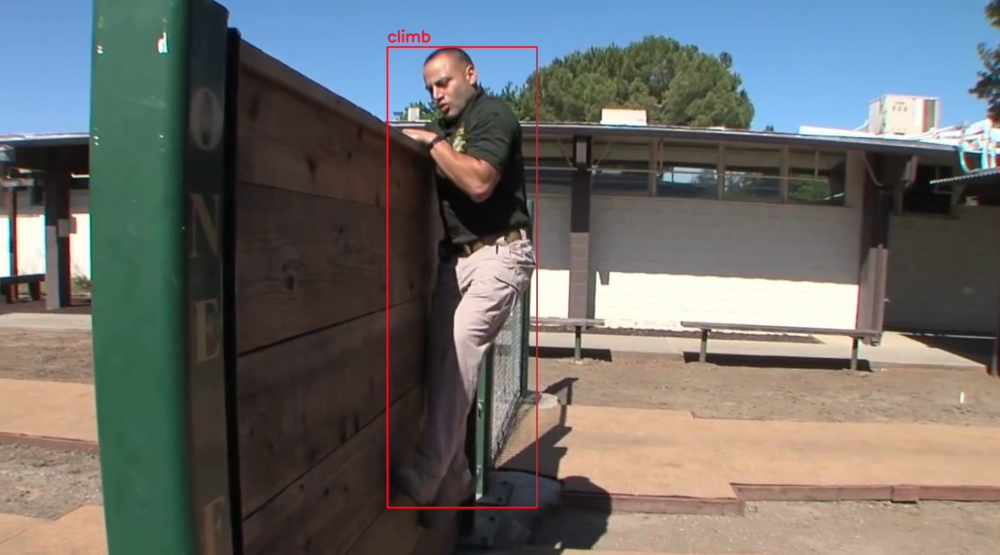

# Human Recognition
## 1. Introduction


## 2. Inference
- First, you need to train an YOLOv8-pose model or leverage pretrained weights. Then **export** the weights file to **onnx** format following the instruction [here](https://docs.ultralytics.com/tasks/pose/#export). I recommend using the pretrained model [YOLOv8l-pose](https://github.com/ultralytics/assets/releases/download/v8.1.0/yolov8l-pose.pt) because it is accurate enough although a bit slow.
- Second, it's also necessary to prepare a **video** for infering.
- After that, you can run the following command and watch the result:
```
python demo.py -iv demo.mp4
```

## 2. References
- [x] DD-Net: A Double-feature Double-motion Network - [Link GitHub](https://github.com/fandulu/DD-Net)
- [x] Convert Keras to Onnx - [Link](https://onnxruntime.ai/docs/tutorials/tf-get-started.html)
